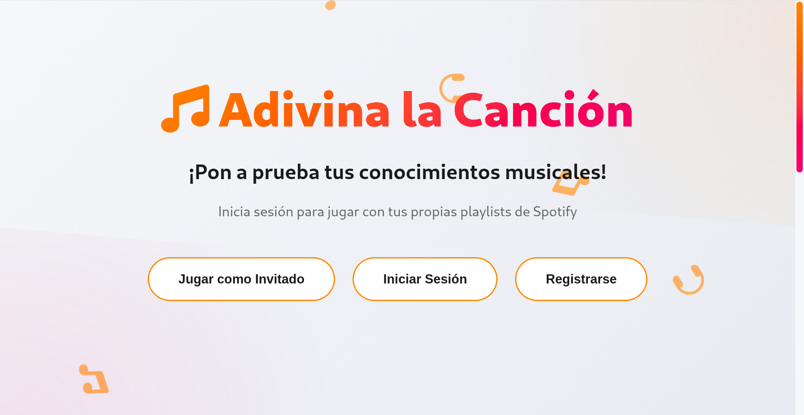
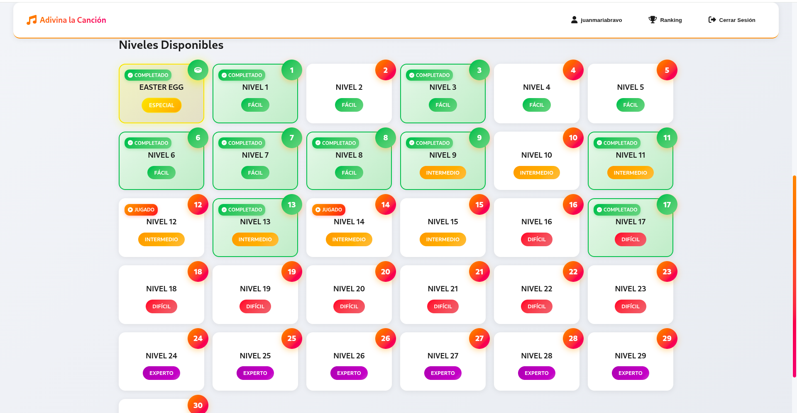
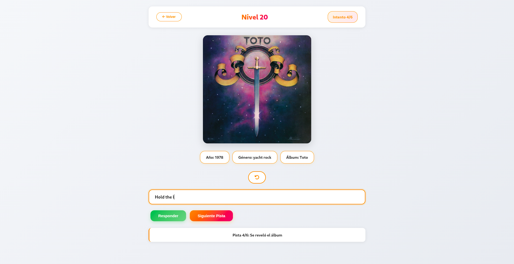
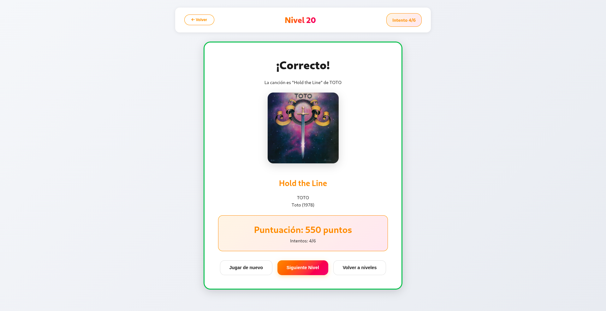
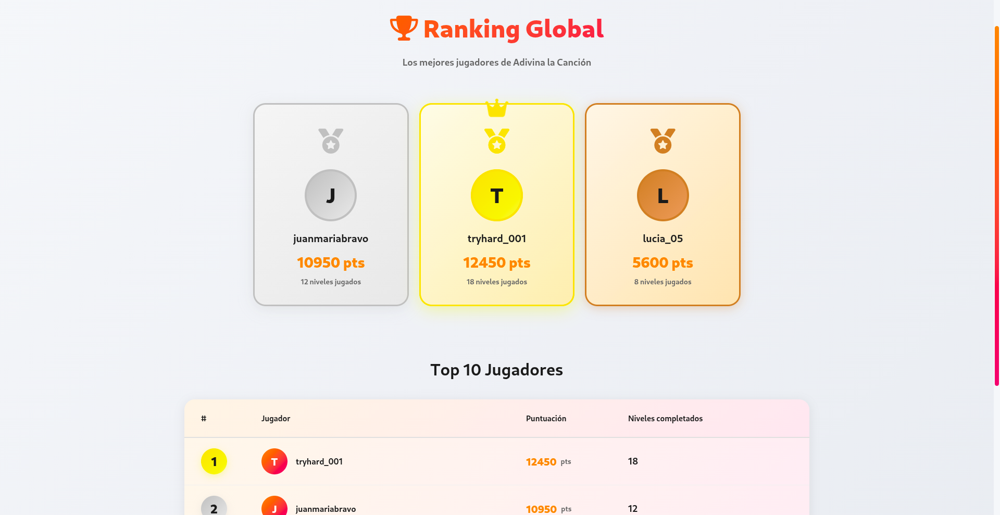
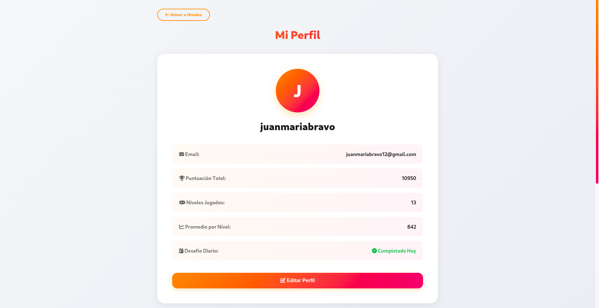
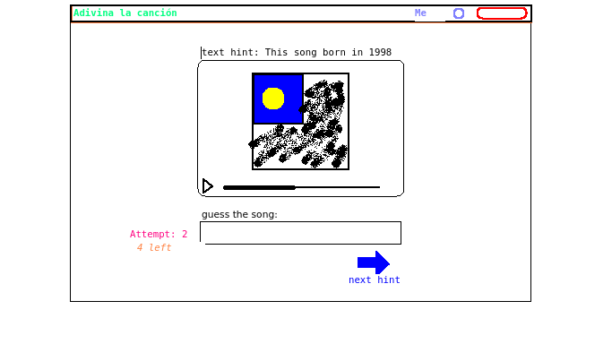

# ♪ Adivina la Canción - *¿Cuánto sabes de música?*

**Adivina la Canción** es una aplicación web interactiva que desafía a los usuarios a identificar canciones a partir de pistas multimedia. Cada pista ofrece fragmentos de audio, imágenes parciales y datos del artista o del lanzamiento para poner a prueba tu oído y tu memoria musical.

> Este proyecto ha sido desarrollado para la asignatura de Multimedia del cuarto curso del grado en Ingeniería Informática, de la Universidad de Castilla La Mancha.



*Página principal de Adivina la Canción*

---

## → Tecnologías utilizadas
- **Frontend:** Angular 19, TypeScript, HTML5, CSS3
- **Backend:** Flask (Python 3.x)
- **Base de datos:** SQLite
- **API externa:** Spotify Web API
- **Autenticación:** JWT (JSON Web Tokens)
- **CORS:** Flask-CORS para permitir peticiones cross-origin

---

## ▶ Características principales

- **Modo invitado:** Juega sin registro usando canciones predefinidas
- **Modo registrado:** Crea tu cuenta y conecta con Spotify para guardar tu progreso
- **Integración con Spotify:** Reproduce todos los fragmentos de canciones usando la API oficial
- **Niveles de dificultad:** Fácil, Medio, Difícil y Experto
- **Sistema de puntuación:** Gana puntos por rapidez y precisión
- **Ranking global:** Compite con otros jugadores
- **Perfil personalizado:** Estadísticas y progreso de juego
- **Modo diario:** Canción del día con desafío especial
- **Diseño responsive:** Juega desde cualquier dispositivo

---

## ◊ Estructura del proyecto

```
adivina_la_cancion/
├── backend/
│   ├── app.py                       # Aplicación principal Flask con blueprints
│   ├── adivina_la_cancion.db          # Base de datos SQLite
│   ├── .env                           # Variables de entorno (no incluido en repo)
│   ├── requirements.txt               # Dependencias Python
│   │
│   ├── controllers/                 # Controladores (endpoints API)
│   │   ├── user_controller.py        # Rutas de autenticación y usuario (/api/v1/auth)
│   │   ├── game_controller.py        # Rutas de juego y puntuación (/api/v1/game, /api/v1/songs, /api/v1/ranking)
│   │   └── spotify_controller.py     # Rutas de integración Spotify (/api/v1/spoti)
│   │
│   ├── services/                    # Lógica de negocio
│   │   ├── user_service.py           # Gestión de usuarios
│   │   ├── game_service.py           # Lógica del juego
│   │   └── spoti_service.py          # Integración con Spotify API
│   │
|   ├── helpers/                     # Funciones auxiliares
|   |   ├── spotify_preview.py        # Generación de previews de canciones usando web scraping
│   │   ├── spotify_helper.py         # Llamadas a Spotify API y a spotify_preview.py para obtener canciones y su info
│   │
│   ├── models/                      # Modelos de datos
│   │   ├── user.py                   # Modelo de usuario
│   │   └── song.py                   # Modelo de canción
│   │
│   ├── database/                    # Gestión de base de datos
│   │   └── database.py               # Conexión y operaciones SQLite
│   │
│   └── songs_local_data&spotify_ids/  # Datos de canciones
│       ├── local_songs.json          # Canciones locales (modo invitado)
│       ├── possible_daily_songs.json # Lista de los IDs posibles para canción del día
│       └── spotify_songs.json        # IDs de canciones Spotify por nivel
│
└── frontend/
    ├── src/
    │   ├── app/
    │   │   ├── app.component.ts      # Componente raíz
    │   │   ├── app.routes.ts         # Configuración de rutas
    │   │   ├── app.config.ts         # Configuración global
    │   │   │
    │   │   ├── home/                 # Página principal
    │   │   ├── login/                # Inicio de sesión
    │   │   ├── register/             # Registro de usuario
    │   │   ├── game/                 # Pantalla de juego
    │   │   ├── levels/               # Selección de niveles
    │   │   ├── ranking/              # Tabla de clasificación
    │   │   ├── profile/              # Perfil de usuario
    │   │   └── callback/             # Callback OAuth Spotify
    │   │
    │   ├── services/               # Servicios
    │   │   ├── user.service.ts      # Gestión de autenticación
    │   │   ├── game.service.ts      # Lógica de juego
    │   │   └── spotify.service.ts   # Comunicación con API Spotify
    │   │
    │   ├── environments/            # Configuración de entornos
    │   │   ├── environment.ts        # Configuración variables desarrollo
    │   ├── styles.css               # Estilos globales
    │   ├── index.html               # HTML principal
    │   └── main.ts                  # Punto de entrada
    │
    ├── angular.json                  # Configuración Angular
    ├── package.json                  # Dependencias Node.js
    └── tsconfig.json                 # Configuración TypeScript
```

## 𖤓 Diagrama de arquitectura y tecnologías


---

## ⚙ Instalación y ejecución

### 1. Clonar el repositorio

```shell
git clone https://github.com/juanmariabravo/adivina_la_cancion
cd adivina_la_cancion
```

### 2. Instalar dependencias

#### Backend
```shell
cd backend
python3 -m venv venv
source venv/bin/activate  # Windows: venv\Scripts\activate
pip install -r requirements.txt
```

#### Frontend
```shell
cd frontend
npm install
```

### 3. Configurar variables de entorno

Crea un archivo `.env` en `backend/`:

```env
# Seguridad
SECRET_KEY=tu_clave_secreta_aleatoria_de_al_menos_32_caracteres

# Servidor
PORT=5000
DEBUG=True

# Base de datos (puedes usar cualquier otra ruta válida)
DATABASE_PATH=adivina_la_cancion.db

# Spotify Redirect URI
SPOTIFY_REDIRECT_URI=http://127.0.0.1:4200/callback

# Spotify API URLs
SPOTIFY_AUTH_URL=https://accounts.spotify.com/authorize
SPOTIFY_TOKEN_URL=https://accounts.spotify.com/api/token
SPOTIFY_API_URL=https://api.spotify.com/v1
```

> ⚠ **Importante:** Registra tu aplicación en [Spotify Developer Dashboard](https://developer.spotify.com/dashboard/applications) y configura la URI de redirección a `http://127.0.0.1:4200/callback`. Necesitarás el `CLIENT_ID` y `CLIENT_SECRET` para el registro en la aplicación.

### 4. Ejecutar la aplicación

#### Backend
```shell
cd backend
source venv/bin/activate  # Windows: venv\Scripts\activate
python3 app.py
```
El servidor estará disponible en `http://127.0.0.1:5000`

#### Frontend
```shell
cd frontend
ng serve --open --host 127.0.0.1
```
La aplicación se abrirá en `http://127.0.0.1:4200`

---

## ◈ Novedades y mejoras recientes

### Arquitectura
- [✓] **Patrón MVC:** Separación clara entre controladores, servicios y modelos
- [✓] **Blueprints Flask:** Organización modular de rutas API
- [✓] **CORS configurado:** Permite comunicación segura frontend-backend

### Funcionalidades
- [♪] **Canción del día:** Sistema de desafío diario rotativo
- [↻] **Refresh tokens:** Renovación automática de tokens de Spotify
- [▦] **Ranking mejorado:** Sistema de puntuación más preciso
- [▶] **Gestión de niveles:** Progreso guardado por usuario

### Base de datos
- [※] **Tablas optimizadas:** `users`, `local_songs`, `spotify_songs`
- [●] **Tokens Spotify:** Almacenamiento seguro con fecha de expiración
- [▲] **Estadísticas:** Niveles completados, puntuación total, último desafío

---

## ◫ Dependencias principales

### Backend
```
Flask>=3.0.0
Flask-CORS>=4.0.0
python-dotenv>=1.0.0
requests>=2.31.0
bcrypt>=4.1.0
PyJWT>=2.8.0
```

### Frontend
```
@angular/core: ^19.0.0
@angular/router: ^19.0.0
@angular/common: ^19.0.0
typescript: ~5.6.2
```

---

## ◉ Seguridad

- [●] Contraseñas hasheadas con bcrypt
- [※] Autenticación JWT con expiración de 24h
- [↻] Tokens de Spotify con renovación automática
- [▣] Validación de datos en frontend y backend
- [×] CORS configurado para orígenes específicos

---

## ◐ Recursos útiles

- [Spotify Web API Documentation](https://developer.spotify.com/documentation/web-api/)
- [Flask Documentation](https://flask.palletsprojects.com/)
- [Angular Documentation](https://angular.io/docs)
- [SQLite Documentation](https://www.sqlite.org/docs.html)

---

## ◬ Otras imágenes de la aplicación


*Pantalla de selección de niveles*



*Pantalla de juego en nivel 20*



*Pantalla tras resolver el nivel 20*



*Tabla de clasificación global*



*Perfil de usuario con estadísticas*



*Boceto rápido del juego Adivina la Canción*

---

## ◈ Licencia

Este proyecto se desarrolla con fines educativos para la asignatura de Multimedia en la Universidad de Castilla-La Mancha.

---

## ※ Autor

**Juan María Bravo López**  
Estudiante de Ingeniería Informática, especializado en Tecnologías de la Información

---

## ◊ Contribuciones

Este es un proyecto académico. Si tienes sugerencias o encuentras bugs, no dudes en abrir un issue.
